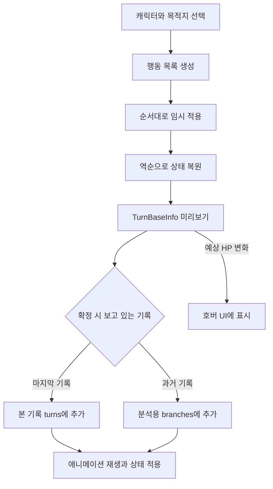

# 체서캣 개발자 탐색 가이드

[README로 돌아가기](../README.md)

이 문서는 체서캣의 코드 구조와 데이터 연결을 따라가며 프로젝트를 살펴보실 수 있도록 작성한 안내서입니다. 게임의 초기화부터 캐릭터·전투·기보·튜토리얼까지 주요 흐름을 설명하고, 콘텐츠를 추가하거나 수정할 때 필요한 코드와 에셋을 함께 정리했습니다.

## 시작과 생명주기

게임의 출발점은 [SampleScene](../Assets/6.Scenes/SampleScene.unity)의 [GameManager](../Assets/0.Scripts/Managers/GameManager.cs)다. Inspector의 `startScreen`은 `Battle`로 저장되어 있다. 클래스 필드의 기본값 `Title`과 씬의 실제 설정이 다르므로 실행 흐름을 읽을 때 씬도 함께 확인한다.

`Awake()`에서 싱글턴을 정하고 `InitializeManagers()` 코루틴을 시작한다. 필요한 매니저 컴포넌트를 확보한 뒤, 씬에 있는 Canvas와 로딩 UI를 먼저 연결하고 다음 순서로 `Connect()`를 호출한다.

`DB → Data → ObjectM → UI → Save → Setting → Language → Audio → Camera → Input → Tile → Battle`

`Data`가 먼저 리소스를 모으고 `ObjectM`이 풀을 준비해야, `UI`가 이름으로 화면을 생성할 수 있다. 초기화 완료 시에는 로딩 UI가 입력을 기다렸다가 배틀 화면을 연다. 이후 맵 로드는 `SaveManager`의 별도 명령으로 시작된다.

| 구성 요소 | 책임 |
| --- | --- |
| [ManagerBase](../Assets/0.Scripts/Managers/ManagerBase.cs) | `Connect` / `Disconnect`와 각 매니저의 연결 코루틴 계약 |
| [GameManager](../Assets/0.Scripts/Managers/GameManager.cs) | 매니저 접근점, 초기화 순서, 중앙 업데이트 이벤트, 일시정지 |
| [DataManager](../Assets/0.Scripts/Managers/DataManager.cs) | Addressables 로드, 타입·이름별 원본 데이터 조회 |
| [ObjectManager](../Assets/0.Scripts/Managers/ObjectManager.cs) | 이름 기반 생성, 풀 재사용, `IFunctionable` 등록·해제 |
| [InputManager](../Assets/0.Scripts/Managers/InputManager.cs) | Input Actions를 이벤트로 중계, 커서·UI·선택 대상 판별 |
| [TileManager](../Assets/0.Scripts/Managers/TileManager.cs) | 보드, 점유, 행마 후보, 타일 입력 모드, 강조와 가이드 |
| [BattleManager](../Assets/0.Scripts/Managers/BattleManager.cs) | 캐릭터·컨트롤러 목록, 행동 기록·분기·재생, 목표 진행 |
| [SaveManager](../Assets/0.Scripts/Managers/SaveManager.cs) | JSON 로드·저장, 행동 타입 등록과 복원 |
| [UIManager](../Assets/0.Scripts/Managers/UIManager.cs) | 화면·창·오버레이 등록과 전환, UI 프리팹 생성 |
| [CameraManager](../Assets/0.Scripts/Managers/CameraManager.cs) | 보드·UI 영역을 고려한 이동 범위, 줌, 대화·목표 연출 잠금 |
| [SettingManager](../Assets/0.Scripts/Managers/SettingManager.cs) | 현재 화면 방향·프레임 제한 등의 초기 설정 |
| [DBManager](../Assets/0.Scripts/Managers/DBManager.cs) | Firebase 인증·DB 코드. 현재 연결 시 초기화 호출은 비활성 |
| [AudioManager](../Assets/0.Scripts/Managers/AudioManager.cs), [LanguageManager](../Assets/0.Scripts/Managers/LanguageManager.cs) | 연결 계약만 있는 초기 뼈대 |

`GameManager.Update()`는 초기화 이벤트를 **Manager → Character → Controller → Object → UI**, 일반 업데이트를 **Manager → Controller → Character → Object → UI** 순서로 처리한다. 제거 이벤트는 **UI → Object → Controller → Character → Manager** 순서다. 캐릭터가 있어야 컨트롤러를 연결할 수 있고, 판단과 행동의 결과가 나온 뒤 UI를 갱신하는 흐름이다. `FixedUpdate()`에는 캐릭터·오브젝트 물리 이벤트가 별도로 있다.

새 오브젝트가 `IFunctionable`을 구현하면 `ObjectManager`가 생성 시 `RegistrationFunctions()`, 제거 시 `UnregistrationFunctions()`를 호출한다. 풀로 돌아가는 오브젝트도 이 경로를 사용하므로, 이벤트 구독 해제를 Unity의 `OnDestroy()`에만 맡기지 않도록 구조를 읽어야 한다.

## 이름으로 연결되는 데이터

런타임은 긴 에셋 경로를 매번 직접 지정하기보다 **타입과 이름**을 키로 사용한다.

1. [Addressables 그룹](../Assets/AddressableAssetsData/AssetGroups/Default%20Local%20Group.asset)에 `Origin/Prefabs/Globals`와 `Origin/ScriptableObjects/Globals` 폴더가 `Global` 라벨로 등록되어 있다.
2. `DataManager`가 `Global`의 `GameObject`, `PoolRequest`, `ItemContainer`, `CharacterPreset`, 타일·벽 데이터, `ChatContainer`, `ObjectiveBase`를 타입별로 로드한다.
3. 로드한 원본은 `Dictionary<Type, Dictionary<string, Object>>`에 저장한다. 안쪽 키는 **에셋의 `name.ToLower()`**다.
4. `DataManager.LoadDataFile<T>(name)`으로 데이터를 찾고, `ObjectManager.CreateObject(name)`은 등록된 풀을 먼저 조회한 뒤 일반 프리팹 생성으로 넘어간다.

Addressables의 주소와 게임 내부의 조회 이름은 역할이 다르다. 같은 로드 타입에서 이름이 대소문자만 다르거나 중복되면 내부 딕셔너리의 `TryAdd`에서 충돌할 수 있다.

| 이름을 쓰는 위치 | 예시 | 연결 대상 |
| --- | --- | --- |
| `CharacterSaveData.presetName` | `Gunner` | `CharacterPreset` 에셋 |
| `StageSaveData.objectiveList` | `TheBeginning_PlaceHeroes` | `ObjectiveBase` 파생 에셋 |
| 목표의 `sequenceOnStart` / `sequenceOnClear` | `TheBeginning_Intro` / `TheBeginning_Complete` | `ChatContainer` 에셋 |
| `ChatData.fromTag` | `Hero`, `King` | 전투에 있는 캐릭터의 **프리셋 이름** |
| `PoolSetting.poolName` | `CharacterBase`, `Tile` | 풀에 등록한 프리팹 |
| 화면의 `requiredUI[].prefabName` | `InventoryMenu`, `TileEditor` | UI 프리팹 |

캐릭터의 표시 이름인 `displayName`을 바꾸는 것과 에셋 이름을 바꾸는 것은 영향 범위가 다르다. `fromTag` 검색은 `Preset.name == targetName` 비교를 사용하므로, 이 연결에는 소문자 자동 변환이 적용되지 않는다. 같은 프리셋의 캐릭터가 여러 개면 첫 검색 결과가 사용된다.

풀 원본은 [PoolRequests](../Assets/1.Datas/Origin/ScriptableObjects/Globals/PoolRequests)에 있다. `GlobalCharacterPool`, `GlobalControllerPool`, `GlobalEffectPool`, `GlobalObjectPool`, `GlobalUIPool`을 읽고 [ObjectPoolModule](../Assets/0.Scripts/Managers/ManagerModules/ObjectPoolModule.cs)이 초기 개수·추가 개수에 맞춰 준비한다. 풀과 에셋을 수정할 때는 `.meta`의 GUID와 프리팹 연결도 함께 유지한다.

## 캐릭터와 보드

### 프리셋과 모듈

런타임 캐릭터 생성은 [CharacterBase.prefab](../Assets/1.Datas/Origin/Prefabs/Globals/GameObjects/Units/CharacterBase.prefab)을 사용한다. 이 프리팹은 [PawnBase.prefab](../Assets/1.Datas/Origin/Prefabs/Globals/GameObjects/Units/PawnBase.prefab)의 Variant이므로, 컴포넌트 일부는 부모 프리팹에 있다.

| 구성 요소 | 역할 |
| --- | --- |
| [CharacterBase](../Assets/0.Scripts/Objects/Characters/CharacterBase.cs) | ID, 소유 컨트롤러, 주인·종자 관계, 프리셋 적용, 모듈 사전, 선택·상태 이벤트 |
| [CharacterPreset](../Assets/0.Scripts/ScriptableObjects/CharacterPreset.cs) | `masterInfo`와 `pawnInfo`에 이름·아이콘·Sprite Library·크기·수치·이동·공격 설정 보관 |
| [CharacterModule](../Assets/0.Scripts/Objects/Characters/CharacterModules/CharacterModule.cs) | 소유자 등록·해제와 설정 적용의 확장 지점 |
| [ChessMovementModule](../Assets/0.Scripts/Objects/Characters/CharacterModules/ChessModule/ChessMovementModule.cs) | 프리셋의 행마를 해석하고 가능한 이동·공격 후보와 강조 표시 생성 |
| [HitPointModule](../Assets/0.Scripts/Objects/Characters/CharacterModules/HitPointModule.cs) | HP 값과 변경 이벤트 |
| [AnimationModule](../Assets/0.Scripts/Objects/Characters/CharacterModules/AnimationModule.cs) | 프리셋 외형 적용, 선택·방향·행동 애니메이션 |
| [CharacterShaderModule](../Assets/0.Scripts/Objects/Characters/CharacterModules/CharacterShaderModule.cs) | 마우스 호버 시 외곽선 셰이더 키워드 제어 |
| [ControllerBase](../Assets/0.Scripts/Objects/Controllers/ControllerBase.cs) | 여러 기물의 소유·선택 |
| [PlayerController](../Assets/0.Scripts/Objects/Controllers/PlayerController.cs) | 사용자 명령, 드래그, 후보 행동 미리보기·확정 |
| [ChessAIBaseController](../Assets/0.Scripts/Objects/Controllers/ChessAIBaseController.cs) | 가능한 공격을 우선해 무작위 행동 선택 |

고양이를 선택할 때 `OnSelected`가 `AnimationModule`의 Animator `Selected` 값으로 이어진다. [CatBaseAnim.controller](../Assets/3.Animations/Characters/CatBaseAnim.controller)의 기본 상태는 `Sleep`이다. 잠든 고양이를 클릭해 깨우는 표현은 선택 이벤트와 애니메이션 상태가 연결된 결과다.

프리셋의 `health`, `move`, `attack`, `Visual`, `scale`에는 실제 적용 경로가 있다. 반면 `damage`는 현재 `CharacterBase.ApplySetting()`에서 `baseDamage`로 옮겨지지 않는다. 실제 피해는 `GetAttackDamage()`가 반환하는 `baseDamage`를 읽으며, 현재 공통 부모 프리팹에는 3이 저장되어 있다. 수치를 조정할 때 프리셋 필드의 존재만으로 적용을 가정하지 않는다.

### 이동 규칙의 구성

`MoveTypeInfo`는 다음 세 값을 묶으며, 프리셋의 `move`와 `attack`에 각각 들어 있다.

| 값 | 의미 | 대표 예 |
| --- | --- | --- |
| `style` | 후보 칸의 기하학적 형태 | `Rook`, `Bishop`, `Knight` |
| `checker` | 통과·도착 및 행동 처리에 쓰이는 방식 | `Charge`, `Jump`, `Through`, `Range` |
| `maxDistance` | 거리 제한 값 | 전차 이동 2, 비숍 이동 3 |

[TileManager](../Assets/0.Scripts/Managers/TileManager.cs)의 `GetAvailableTilesOnStyle()`이 형태를 만들고, [ChessMovementTileCheckers](../Assets/0.Scripts/Objects/Characters/CharacterModules/ChessModule/ChessMovementTileCheckers.cs)가 거리·지형·점유·공격 대상 조건을 검사한다. 공격 범위 표시와 실제 공격 가능한 대상 칸은 별도 조회를 사용한다.

보드는 `TileBase[,]`와 타일별 `TileInfo`로 관리한다. 배열의 크기와 실제 존재하는 타일 수는 다를 수 있다. 바닥·바닥 장식·벽·벽 장식이 각각 데이터 에셋으로 분리되어 있고, 타일의 `socket`이 기물의 시각적 위치를 정한다. 현재 `TileInfo.EnterCheck()`의 판정은 바닥·바닥 장식·점유 상태를 읽으므로 벽 이미지가 있다는 이유만으로 차단을 가정하지 않는다.

정통 체스와의 차이도 소스에서 확인해야 한다. 예를 들어 현재 `Pawn` 후보 생성은 수직 방향이며, 별도로 작성된 `TileChecker_OnlyForward`는 기본 이동 검사 목록에 등록되어 있지 않다. 체크·캐슬링·앙파상·프로모션을 포함한 완성된 체스 규칙 엔진으로 해석하지 않는다.

## 행동과 기보

### 한 번의 명령이 기록이 되기까지

플레이어가 선택한 캐릭터와 목적지에서 [TurnActionBuilder](../Assets/0.Scripts/Turns/TurnActionBuilder.cs)가 `TurnBaseInfo`를 만든다. [CharacterBaseAction](../Assets/0.Scripts/Objects/Characters/CharacterModules/CharacterBaseAction.cs)은 그 명령을 이루는 `TurnActionInfo`들을 순서대로 내보낸다.

`BuildActionArray()`는 각 행동에 `GoNext(false)`를 호출해 다음 행동이 변경된 상태를 기준으로 만들어지게 한다. 예를 들어 피해를 임시 적용한 뒤 생존 여부를 보고 퇴장 행동을 추가할 수 있다. 생성이 끝나면 `finally`에서 이미 적용한 행동을 역순으로 `GoPrev(false)`하여 원래 상태로 돌아간다.

따라서 새 행동을 만들 때 **정방향 적용과 역방향 복원이 대응되어야 한다.** 돌이킬 수 없는 외부 작업을 이 계산 경로에 넣으면 미리보기만으로도 작업이 실행될 수 있다.

| 메서드 | 역할 |
| --- | --- |
| `GoNext(bool resetAnim)` | 행동 이후의 논리 상태 적용 |
| `GoPrev(bool resetAnim)` | 행동 이전의 논리 상태 복원 |
| `Play()` | 코루틴으로 표현을 재생. `TurnBaseInfo.Play()`는 이후 `GoNext(true)`도 호출 |
| `GetHealthDelta()` | UI가 표시할 예상 HP 변화 전달 |

[TurnActionInfo.cs](../Assets/0.Scripts/Turns/TurnActionInfo.cs) 한 파일에 이동, 밀치기, 퇴장, 공격 애니메이션, 원위치 복귀, 대화, 체력 변화, 피해·회복 클래스가 함께 들어 있다. 파일명 하나가 행동 한 종류라는 구조는 아니다.

현재 근접 공격은 접근 가능한 이동, 공격 애니메이션, 피해·피격 대화, 생존 대상의 밀치기, 대상 칸으로의 이동 또는 복귀 행동으로 조립된다. 원거리 분기는 공격자 접근 없이 피해 경로를 사용한다. 피해 행동에 `Damaged` 대화가 연결되어 있으므로 전투 중 대화 진행을 기다리는 구간이 생길 수 있다.

### 기록·미리보기·분기 구분

| `BattleManager`의 상태 | 용도 |
| --- | --- |
| `turns` | 본 행동 기록 |
| `simulatedTurn` | 현재 목적지에서 예상하는 행동 |
| `branches` | 과거 기록을 보고 있는 동안 시험하는 다른 행동들 |
| `guides` / `branchGuides` | 각 기록 위치에 연결한 가이드 표시 |
| `CurrentPlay` | 현재 재생 중인 코루틴 |

`IsAnalysisMode`는 본 기록의 마지막 위치를 보고 있지 않은 상태이고, `IsBranchMode`는 별도 분기가 존재하는 상태다. 과거로 이동한 뒤 다른 행동을 확정해도 본 기록을 직접 덮어쓰지 않고 `branches`에 넣는다. `AnalysisModeEnd()`는 분기를 역으로 제거한다. 마지막 기록으로 돌아가는 입력은 이 분기를 정리하고 본 기록의 마지막 상태로 복귀한다. 여기서 말하는 분기는 **게임 내 분석 기록**이다.

예상 HP는 `TurnBaseInfo.GetHealthDelta()`에서 모아 [UI_CharacterHoverPanel](../Assets/0.Scripts/UIs/Functions/Informations/UI_CharacterHoverPanel.cs)과 [UI_HPBar](../Assets/0.Scripts/UIs/Functions/Informations/UI_HPBar.cs)에 전달한다. 행마 판정, 행동 결과 계산, 표현의 연결을 찾을 때 이 경로가 기준이 된다.

## 출정식의 데이터 연결

출정식은 별도 Unity 씬에 완성된 보드를 배치해 둔 구조가 아니다. [TheBeginning.Json](../Assets/Saves/TheBeginning.Json)을 읽어 보드·캐릭터를 복원하고, 이름으로 목표와 대화를 연결한다.

| 순서 | 코드·데이터 | 처리 |
| ---: | --- | --- |
| 1 | `F8` → `SaveManager.LoadCliffChess()` | `Application.dataPath/Saves/TheBeginning.Json` 읽기 |
| 2 | `SaveManager.LoadData()` → `TileManager.LoadData()` | `stage.fieldData`의 타일과 배치 오브젝트 복원 |
| 3 | `BattleManager.StartBattleFromData()` / `LoadData()` | 컨트롤러·캐릭터·기록 생성, 전투 시작 알림 |
| 4 | `stage.objectiveList` | `TheBeginning_PlaceHeroes` 목표 조회 |
| 5 | `ObjectiveBase.Start()` | `sequenceOnStart`의 시작 대화를 실행하고 종료까지 대기 |
| 6 | `Objective_PlaceOnTile.OnObjectiveStart()` | 목표 칸을 표시하며 카메라로 소개 |
| 7 | `ObjectiveStartComplish()` | 카메라와 입력 차단 해제, 배치 조작 시작 |
| 8 | `CheckClearCondition()` / `Clear()` | 네 칸 점유 확인, 완료 대화와 전투 종료 경로 진행 |

실제 연결 원본은 [TheBeginning_PlaceHeroes.asset](../Assets/1.Datas/Origin/ScriptableObjects/Globals/Objectives/TheBeginning_PlaceHeroes.asset), [TheBeginning_Intro.asset](../Assets/1.Datas/Origin/ScriptableObjects/Globals/Chats/TheBeginning_Intro.asset), [TheBeginning_Complete.asset](../Assets/1.Datas/Origin/ScriptableObjects/Globals/Chats/TheBeginning_Complete.asset)이다.

목표의 `onlyPlayerCharacters`가 켜져 있고 대상 칸 네 개가 등록되어 있다. 완료 조건은 네 칸 모두에 플레이어 소유 캐릭터가 있는지 검사한다. 현재 목표는 캐릭터 이름별 배치표를 갖고 있지 않다.

[ChatEvents](../Assets/0.Scripts/Managers/ManagerModules/ChatEvents.cs)는 대화 요청과 상태를 중계한다. [UI_ChatArea](../Assets/0.Scripts/UIs/Functions/Informations/UI_ChatArea.cs)가 말풍선·내레이션·소개문을 선택하고 다음 문장 입력 및 카메라 잠금을 처리한다. `PlayerController.IsControlFailed()`와 인게임 영역의 차단 로직이 대화·연출 중 조작을 제한한다.

`UI_ObjectiveVisualizer`는 목표 연출 Animator를 제어한다. 화면의 제목·목표 문구까지 모두 JSON에서 자동으로 갱신되는 구조로 가정하면 안 된다. 실제 텍스트와 연출 참조는 [BattleScreen.prefab](../Assets/1.Datas/Origin/Prefabs/Globals/UIs/Screens/BattleScreen.prefab)도 함께 확인한다.

## 저장과 로드

[SaveStructures](../Assets/0.Scripts/Managers/ManagerModules/SaveStructures.cs)는 파일 형식, [SaveDataHelper](../Assets/0.Scripts/Managers/ManagerModules/SaveDataHelper.cs)는 런타임 객체와 저장 구조 사이의 변환을 담당한다.

| 데이터 | 주요 내용 |
| --- | --- |
| `BattleSaveData` | 플레이어, 캐릭터 목록, 행동 기록, 가이드, 스테이지 |
| `StageSaveData` / `BoardSaveData` | 목표 이름, 보드 크기, 타일 목록 등 |
| `CharacterSaveData` | 프리셋 이름, 시작 위치, 소유자·주인·종자 ID, 사용자 정의 값 |
| `TurnSaveData` / `ActionSaveData` | 행동 목록, 시작·도착 좌표, 기록 문구, 행동 타입 이름 |
| `CustomSaveData` | `key` / `value` 문자열 배열 |

각 행동의 `[SaveNameSet("Base.Move")]` 같은 이름이 직렬화 키가 된다. `SaveManager`는 구체적인 `TurnActionInfo` 파생 타입을 찾아 등록하고, `SaveRegister`는 **`ActionSaveData`를 받는 생성자**로 복원한다. 새 행동을 추가할 때 고유한 저장 이름, 생성자, 사용자 정의 데이터 작성·복원을 함께 제공해야 한다.

| 샘플 파일 | 현재 내용과 진입 |
| --- | --- |
| [TheBeginning.Json](../Assets/Saves/TheBeginning.Json) | 13×10 영역에 실제 타일 100개, 캐릭터 13개. 플레이어 영웅 4명과 NPC·종자, 배치 목표. `F8` |
| [ClassicChess.Json](../Assets/Saves/ClassicChess.Json) | 8×8 보드와 32기물의 기본 배치 시험. `F7` |
| [Test.Json](../Assets/Saves/Test.Json) | 개발용 빠른 저장 대상. `F5`로 덮어쓰고 `F6`으로 로드 |
| [Cliff.Json](../Assets/Saves/Cliff.Json) | 15×26 영역에 실제 타일 262개가 있는 별도 지형 시험 데이터. 현재 `F8` 대상은 아님 |

임의 파일을 로드하는 코드 진입점은 매니저 초기화 이후의 `SaveManager.ClaimLoadFromDirectory(path)`다. 현재 경로는 `Application.dataPath/Saves`이며, 플레이어 영속 저장소나 배포용 데이터 로더로 전환된 상태는 아니다.

저장 구조와 복원 구현의 범위도 구분한다. `BattleManager.MakeSaveData()`는 처음 기록 상태로 이동해 초기 배치와 행동 기록을 저장한 뒤 표시 위치로 돌아간다. 그러나 현재 `LoadData()`에서 `currentStage`를 로드된 스테이지로 설정하는 연결은 없고, 캐릭터 사용자 정의 값에도 완전한 복원 경로가 갖춰진 것은 아니다. **F5/F6을 모든 목표 진행·성장 상태의 완전한 저장 보장으로 해석하지 않는다.** 기존 JSON에 남은 `introName`도 현재 `StageSaveData` 필드에는 없으며, 출정식 시작 대화는 목표의 `sequenceOnStart`가 연결한다.

## 콘텐츠를 수정하는 곳

### 캐릭터나 행마를 추가할 때

1. [Characters 프리셋 폴더](../Assets/1.Datas/Origin/ScriptableObjects/Globals/Characters)에서 기존 프리셋을 참고한다. Inspector 생성 메뉴는 `Characters/CharacterPreset`이다.
2. `masterInfo` / `pawnInfo`의 외형, HP, 이동과 공격 설정을 정한다. 새로운 판정이 필요하면 `ChessMovementModule`과 `TileManager`의 후보·검사 경로를 확인한다.
3. 새 프리셋이 `Global` 라벨의 로드 범위에 들어가는지 확인하고, 저장 데이터의 `presetName`을 연결한다.
4. 피해·밀치기·특수 효과를 바꿀 때는 `CharacterBaseAction`이 만드는 행동 목록과 `GoNext` / `GoPrev` 쌍까지 확인한다.

외형은 프리셋의 Sprite Library를 [AnimationModule](../Assets/0.Scripts/Objects/Characters/CharacterModules/AnimationModule.cs)에 적용하는 방식이다. 이미지, Sprite Library, 공통 캐릭터 프리팹, [캐릭터 애니메이션](../Assets/3.Animations/Characters)을 함께 살핀다.

### 맵과 목표를 추가할 때

- 맵 배치 원본은 `Assets/Saves/*.Json`, 지형 종류는 [Tiles 데이터](../Assets/1.Datas/Origin/ScriptableObjects/Globals/Tiles)다.
- `F9`로 여는 [UI_TileEditor](../Assets/0.Scripts/Editors/UI_TileEditor.cs)는 **Play 중 사용하는 UI**다. 폴더 이름은 `Editors`지만 Unity의 `EditorWindow` 구현은 아니다.
- 바닥·장식·벽·벽 장식을 선택하고 보드에 칠하거나 복사할 수 있다. F5 저장 대상은 항상 `Test.Json`이므로 새 맵 원본과 혼동하지 않는다.
- [ObjectiveBase](../Assets/0.Scripts/ScriptableObjects/Objectives/ObjectiveBase.cs)를 확장하거나 기존 배치 목표를 참고해 목표 에셋을 만든 뒤 `stage.objectiveList`에 에셋 이름을 넣는다.
- 시작·완료 대화는 목표 에셋의 `sequenceOnStart` / `sequenceOnClear`에서 연결한다. 여러 목표를 연속 구성한다면 현재 `TurnEnd()`와 `OnClearObjective()` 양쪽의 `SetNextObjective()` 호출 흐름도 검토한다.

### 대화와 카메라를 바꿀 때

[Chats](../Assets/1.Datas/Origin/ScriptableObjects/Globals/Chats)의 `ChatContainer.sequence.datas`에 문장을 작성한다. `style`로 말풍선·내레이션·소개를 선택하고, `fromTag` 또는 `isFromClaimer`로 발화 대상을 정한다. 카메라 대상·줌·이동 시간은 각 문장의 `cameraLock` 설정을 따른다. 새 프리셋 이름을 쓴다면 해당 이름을 가진 캐릭터가 전투에 실제 생성되는지도 확인한다.

### UI를 바꿀 때

실제 UI 원본은 [Globals/UIs](../Assets/1.Datas/Origin/Prefabs/Globals/UIs)에 있다. [UIManager](../Assets/0.Scripts/Managers/UIManager.cs)가 화면을 만들고, [UI_ScreenBase](../Assets/0.Scripts/UIs/Screens/UI_ScreenBase.cs)의 직렬화된 목록으로 하위 UI를 연결한다.

| 필드 | 의미 |
| --- | --- |
| `registrationUI` | 화면 안에 들어 있는 UI를 매니저에 등록 |
| `requiredUI` | 이름·타입으로 별도 창을 생성하거나 조회하고 초기 상태 설정 |
| `isOverlay` | 일반 생성 영역 또는 오버레이 영역 선택 |
| `closeWithScreen` | 화면을 닫을 때 함께 닫을 UI 타입 |

화면 배치 변경은 `BattleScreen`, `TitleScreen`과 내부 프리팹부터 시작한다. 새 UI 타입은 [Enumerators.cs](../Assets/0.Scripts/Generals/Enumerators.cs)의 `UIType`, 창의 등록 목록, 입력 이벤트의 실제 구독까지 연결해야 한다. 입력 이름이나 메뉴 프리팹만 추가해서는 동작이 생기지 않는다.

## 아직 확장 지점인 부분

| 위치 | 현재 상태 |
| --- | --- |
| [CharacterPerkBase](../Assets/0.Scripts/Objects/Characters/Perks/CharacterPerkBase.cs) | 내용이 없는 기본 클래스 |
| [TargetChaseAIController](../Assets/0.Scripts/Objects/Controllers/TargetChaseAIController.cs) | 포커스·업데이트 연결의 뼈대. 체스 전투의 기본 AI는 `ChessAI` 프리팹 |
| [Inventory](../Assets/0.Scripts/Objects/Slots/Inventory.cs), [아이템 데이터 코드](../Assets/0.Scripts/ScriptableObjects) | 슬롯 작업은 존재하나 `UseItem`, 일부 검색·이동 API와 사용·장착 효과는 미구현 |
| [Windows](../Assets/0.Scripts/UIs/Windows) | 도감·지도·원정대·퇴장 상자·옵션에 빈 클래스가 존재. 항복 확인도 현재 로그 출력 |
| [LanguageManager](../Assets/0.Scripts/Managers/LanguageManager.cs), [Extensions.Translate](../Assets/0.Scripts/Generals/Extensions.cs) | 언어 서비스는 뼈대이며 `Translate`는 원문 반환 |
| 보스·런 진행 | 체크메이트 전용 페이즈, 성장·보상·프로모션 등의 완성된 진행 연결은 확인되지 않음 |

## 변경 후 확인할 경로

문서만 바꾸는 경우에는 링크·파일명·설명과 실제 연결의 일치를 확인하면 된다. 전투나 데이터를 바꾸는 경우에는 수정한 범위에 맞춰 다음 경로를 선택해 에디터에서 확인한다.

- **튜토리얼:** F8 → 시작 대화 → 목표 소개 → 네 칸 배치 → 완료 대화·결과 화면.
- **행동:** 이동·근접·원거리 후보, 예상 HP와 실제 HP, 밀치기 실패 시 복귀, 퇴장과 복원.
- **기보:** Z/X/C/V 탐색, 과거 기록에서 분기 실행, 본 기록의 마지막 상태로 복귀.
- **저장:** F5/F6 전후의 보드·기물·행동 기록 비교. 목표·사용자 정의 값은 해당 복원 경로까지 확인.
- **리소스:** 새 이름과 `Global` 로드 범위, 프리팹 Variant의 부모·참조, 풀 재사용 시 이벤트 등록·해제.

일부 기존 소스와 `FunctionTable.txt`는 UTF-8이 아닌 CP949로 저장되어 있다. 기존 파일을 편집할 때 인코딩 변경으로 무관한 대량 diff가 생기지 않게 확인한다. `FunctionTable.txt`는 초기 API 메모여서 현재 이름과 다른 항목이 있으며, 실제 선언을 기준으로 탐색하면 된다.
